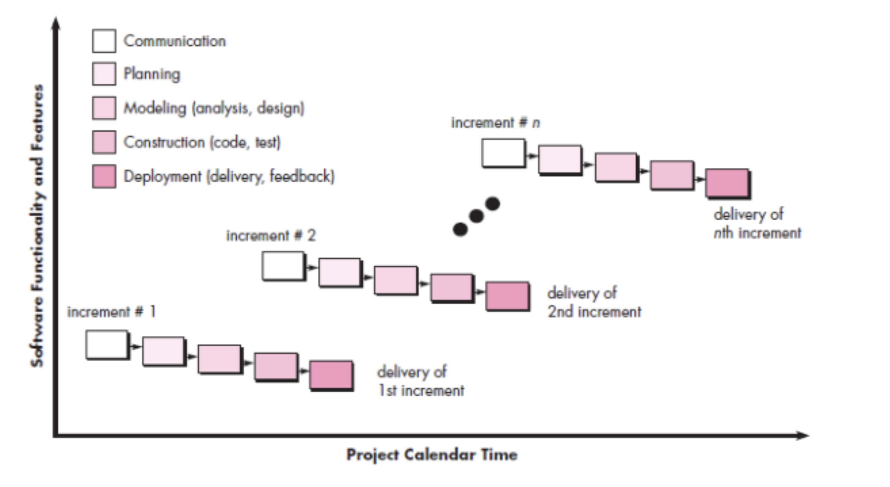
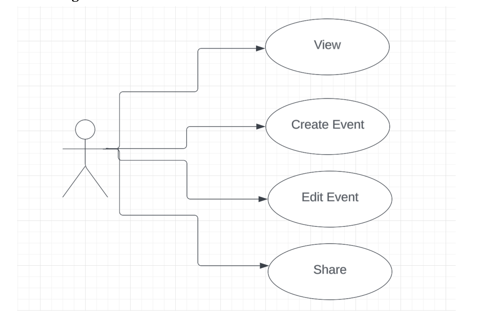
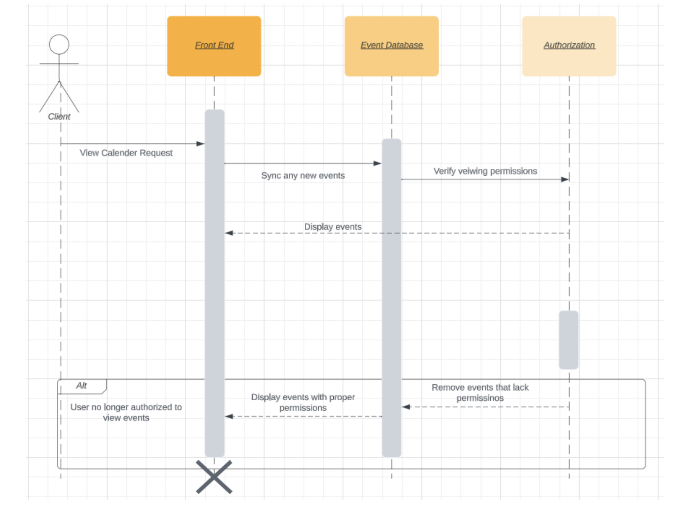
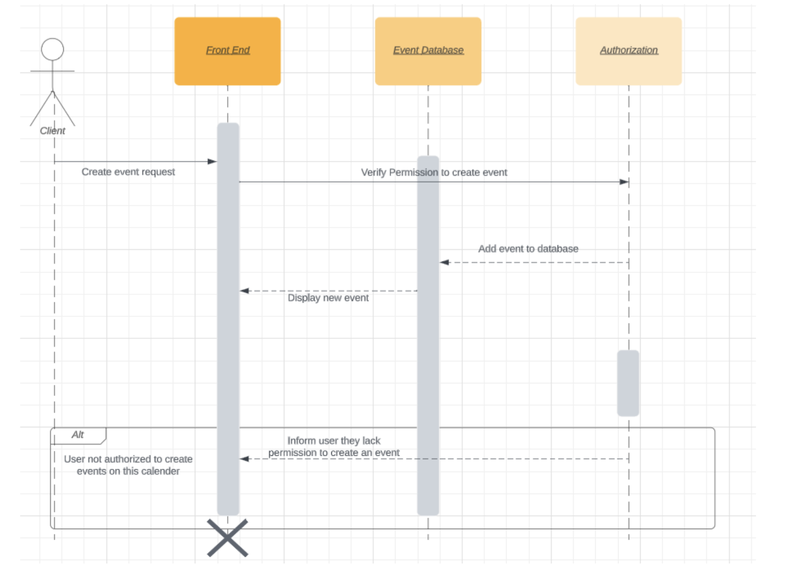
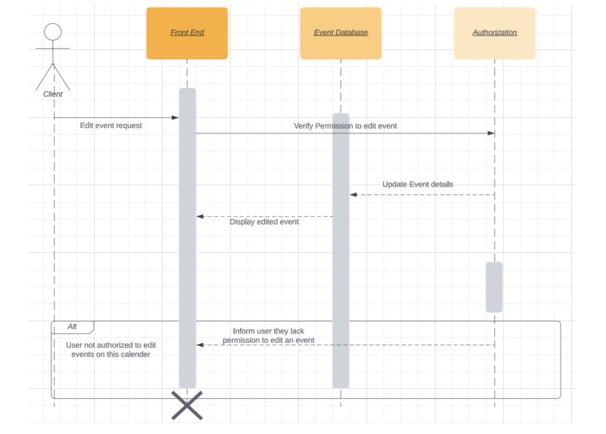
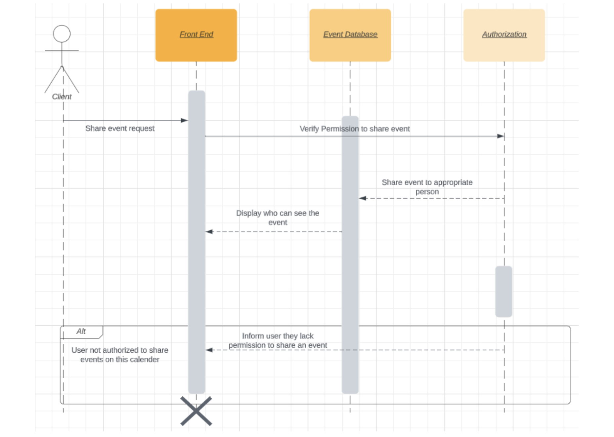
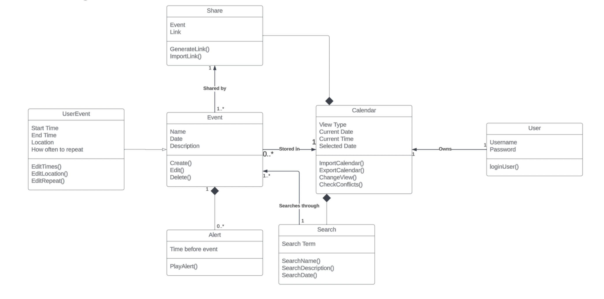

# CS3354 Software Engineering
# Final Project Deliverable 1

## Calendar Software Project

- [Robert Berghian](https://github.com/Robert02110)
- [Henry Jones](https://github.com/daot)
- [Josh Pahman](https://github.com/jpahm)
- [Shelby Pham](https://github.com/ncp9988)
- [Illiana Rodriguez Huerta](https://github.com/illianardz)
- [Isaiah Shadd](https://github.com/Ishadd97)
- [Nathaniel Tan](https://github.com/Nathaniel220000)

### 1. Final Project Draft Description and Feedback

#### What We Are Doing
A versatile calendar software designed to offer a range of essential features for effective time management and organization. It will include various viewing options, each displaying events and schedules. Users will be able to add, edit, delete, and categorize events, with built-in conflict checking and event alerts. The software will also support the creation of recurring events and color-coding for event categories. Moreover, it will provide color highlights for holidays and weekends, and will support zooming and scrolling for enhanced usability.

#### Motivation
Our main motivation is to provide an efficient and user-friendly tool to help individuals better manage their schedules and events. We chose this project because we have experienced first hand the struggle that comes with personal time management, work scheduling, and coordinating with others. Thus, we will address the common challenges that people face in hopes to provide a calendar software that will enhance productivity and user experience.

#### Delegated Tasks
Henry Jones: Will serve as the scrum master, responsible for guiding the project's overall development process.
Josh Pahman: Responsible for guiding the backend development of the project.
Robert Berghian: Responsible for helping with the backend components of the project. Will also be in charge of turning in the documents.
Illiana Rodriguez Huerta: Responsible for guiding the frontend development.
Shelby Pham: Responsible for helping with the frontend components of the project.
Isaiah Shadd: Responsible for guiding the UX development of the project.
Nathaniel Tan: Responsible for helping with the UX components of the project.

#### Addressing Feedback
The feedback we were provided on the Final Project Proposal advised us to compare our calendar application with other applications that have similar functionalities and to differentiate our application from them.
One of the most popular calendar applications, Google Calendar, already has many capabilities, but a few functions can still be optimized. For example, there are many more options to customize an event that a user adds to their calendar than a task. These options range from specifying when a reminder notification will be sent out before the event, adding guests, and finding a time to place the event within the user’s existing schedule.
Building upon the functionalities for tasks and bringing them closer to that of events is one of the primary ways we are aiming to differentiate our app from other popular existing apps such as Google Calendar, but it doesn’t end there. There is the possibility for us to add more unique features later on and focus on other ways of evolving the design of our calendar app.

### 2. Team Project Github Repository
[GitHub] : https://github.com/ncp9988/3354-TimeKeepers   

### 3. Delegation of Tasks
Robert Berghian: Sequence Diagram
Henry Jones: Functional requirements
Josh Pahman: Choosing software process model
Shelby Pham: Case diagram, Architectural Design
Illiana Rodriguez Huerta: Non-functional requirements
Isaiah Shadd: Class Diagram
Nathaniel Tan: Addressing proposal feedback

### 4. Software Process Model
For our project we will be using an incremental process model. The reasoning for this is that the features of calendar software can be easily broken into incremental feature additions, such as the following:
#### Increment 1: 
Add daily, weekly, and monthly views alongside basic event support, providing basic calendar functionality.
#### Increment 2: 
Add an agenda view as well as checking for time conflicts, periodical events, editing and deleting events, and event alerts.
#### Increment 3: 
Implement adding/deleting event categories, color marking for different categories of events, sending events to other calendar users, holidays and weekends in special colors, and zoom-in/zoom-out scroll support.
	Each of these increments consists of a miniature version of the waterfall model, with each increment including communication, planning, modeling, construction, and deployment phases as depicted in the diagram below:

### 5. Software Requirements
#### Functional Requirements:
- Event Scheduling: The software’s most basic feature is scheduling events to the calendar. The user should be able to specify times and dates, locations, durations, repetitions, and a description of the event of their choice. The software should know if an event will conflict with an existing event and alert the user if it’s the case.
- Multiple Calendar Views: Monthly view: show all days in a month, and event snippet for each day, Weekly view: show all days in a week, and event snippet for each day, Daily view: show all events in a day, sorted by their starting time, Agenda view (optional): show all events in future as a list.
- Alerts: The software should be able to notify the user within a set time period of the event scheduled.
- Search: The software should have a search function that lets the user use basic keyword searching to find past events using the name of the event and/or the description of the event.
- Sharing: The software should allow events to be shared between other users of the software. This would be facilitated by sharable internet links.
- Data Import/Export: To be able to keep the software compatible with other calendar softwares, the software should have the ability to export calendar data in a common readable format like CSV or Apple’s iCal.

#### Non-functional Requirements:
##### Product Requirements: 
The calendar software should be accessible to everyone 24 hours 7 days a week, allowing users to manage their schedules at any time.
- Usability Requirements: The software should feature an intuitive and user-friendly interface with clear instructions, tooltips, and user testing.
- Efficiency Requirements: Event creation, editing, and deletion should be processed efficiently, even when managing a large number of events.
Performance Requirements: The software should have a maximum response time of 2 seconds for user interactions, load calendar views within approximately 3 seconds, and support up to 500 simultaneous users.
Space Requirements: The software should optimize data storage to efficiently manage user data and events.
- Dependability Requirements: The software should maintain high availability, with a minimum uptime of 99.9%, and ensure data integrity to prevent loss of user event data.
- Security Requirements: The software should prioritize user authentication and authorization, employ industry-standard encryption for data transmission, and implement protections against cross-site scripting (XSS) and SQL injection.
##### Organizational Requirements: 
Users should identify themselves using their identity credentials.
- Environmental Requirements: The software should prioritize energy efficiency and reduced environmental impact, adhering to the Software Energy Efficiency Act (SEEA-2023). Assumption
- Operational Requirements: The software should seamlessly integrate with the organization's existing infrastructure and systems while maintaining routine backup and recovery procedures.
- Development Requirements: Developers should adhere to organizational coding and development standards mentioned in the Code Review and Quality Assurance Procedures (CRQAP-2023). Assumption
##### External Requirements: 
The software should adhere to data protection regulations, ethical standards, and legislative requirements.
- Regulatory Requirements: The software should comply with the Data Privacy Act (DPA-2023). Assumption
- Ethical Requirements: The software should adhere to ethical standards, particularly in the handling of personal and sensitive user data
- Legislative Requirements: The software should comply with the User Consent and Data Handling Regulation (UCDHR-2023). Assumption
Accounting Requirements: The software should ensure accurate accounting and reporting of user subscriptions.
Safety/Security Requirements: The software should provide secure and reliable access to the user's calendar data, with safeguards against data loss or corruption.

### 6. Case Diagram

### 7. Sequence Diagram

#### View:

#### Create Event:

#### Edit Event:

#### Share:

### 8. Class Diagram

### 9. Architectural Design

#### Model-View-Controller (MVC) pattern
##### Model (M): 
The Model component of your Calendar app is responsible for managing the application's data and business logic.
Event Data: Create a structured representation for events. Include title, date, time, location, and any other event-specific information.
Calendar Data: Manage data related to the calendar, such as date ranges, holidays, and special days. This data is used to render the calendar grid and handle exceptional events.
##### View (V): 
The View component handles the presentation of data to the user and deals with the user interface (UI).
Calendar Interface: Design the user interface elements to display the calendar grid, navigation controls, and event details.
Event Details View: Create the user interface elements that will display the calendar grid, navigation controls, and event information.
Event Creation and Editing Forms: Create forms or dialog boxes that allow users to add, edit, or delete events. These forms should guide users through the event creation and update processes.
Notifications: Create a system that displays reminders and notifications for impending events or special days, keeping users informed of crucial dates and appointments.
##### Controller (C): 
The Controller acts as an intermediary between the Model and the View. It handles user interactions, processes user input, and updates the Model and View accordingly.
Event Handling: To react to user activities like clicking on a date or creating, amending, or removing events, implement event listeners. The Model and View are updated in response to these actions.
Data Validation: Ensure that user inputs, such as event details or date selections, are valid and within the expected range. This step helps maintain data integrity.
Data Flow: In order to ensure that any changes made in one component are correctly reflected in the other, manage the data flow between the Model and View. The calendar user interface must be kept up to date with the underlying data.
Navigation: Organize user navigation inside the software, including changing between month, week, and day views and advancing and regressing in time. For users to interact with the calendar easily, navigation must be effective.
User Authentication: Implement user authentication and access control to protect sensitive data and limit certain actions to authorized users if the Calendar app needs user-specific functionality or event management.
 

